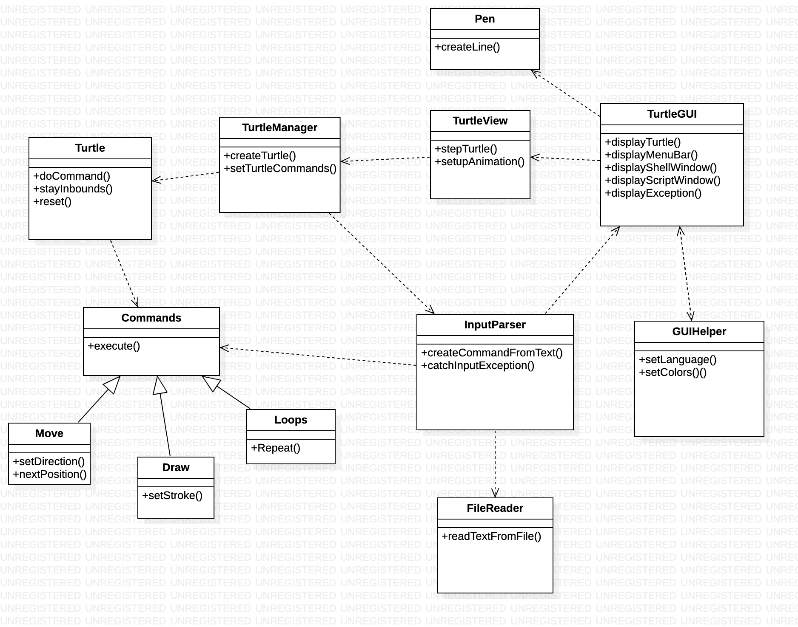
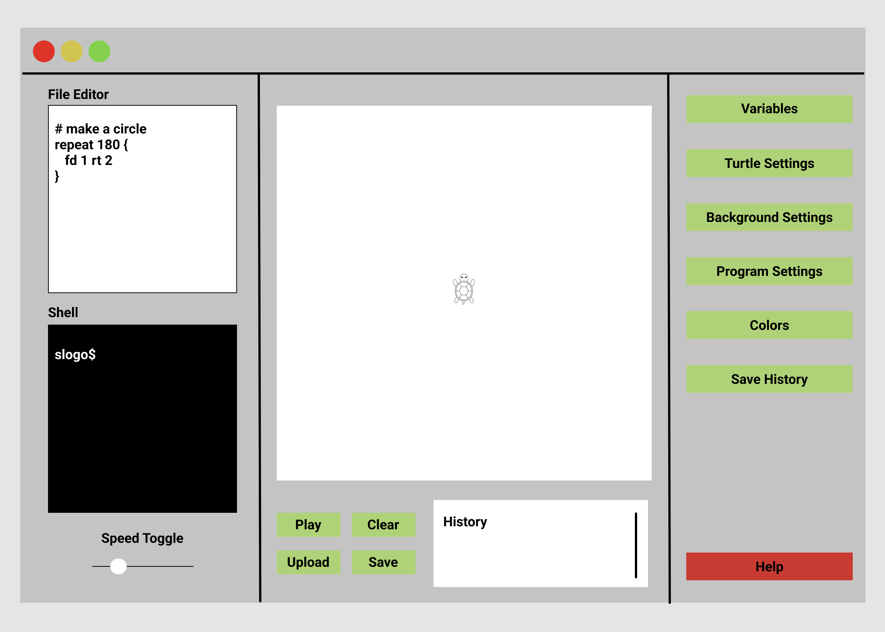

# SLogo Design Plan

### Haris Adnan, Mike Keohane, Saad Lahrichi, Eric Xie

### Team 02

#### Examples

Here is a graphical look at my design:

Here is our amazing UI:

## Introduction

In the SLogo project, our objective is to create a well-designed application that allows a user to
dynamically input commands to control a turtle to draw objects.

- Primary Design Goals here

    - To take in commands and return exception error messages if they're written incorrectly
    - Implementation of new commands
    - GUI that allows for:
        - displaying environment history
        - file editor
        - loading and saving files
        - play and change the speed

    - Able to create multiple Turtles in the program

- Primary Design Architecture here

For the primary design goal, we went with the model-view-controller class structure, similar to what
we did in the cell society project. There is a parser class that communicates with the View and
Controller packages in order to take in the user inputs and files and passes them to the controller
side for managing the turtles.

## Overview

The program is broken up into Model, Controller, and View packages. The View contains the GUI which
displays everything and records inputs from the user. The turtle and drawing displays are handled by
TurtleView and Pen classes. The text inputs are parsed by the InputParser which creates Command
objects which can be used by the Turtle instances. These turtles are initialized and handled by the
TurtleManager which also tells the view how to move the turtle and pen.

## User Interface

The User Interface would consist of a main stage where the user can view the turtle and its
movements. It would also have a commands input box and another box to show the commands' history.
There should also be some buttons: one to start the turtle's movement, one to stop it, one to pick
the turtle's stroke color, one to undo the turtle's last movement (if any).

## Design Details

TurtleManager:
Controller class that acts as the moddle classe between model and View. Stores user input from View,
and holds each instance of Turlte, manages how each turtle moves and draws in the window.

## Design Considerations

One consideration we discussed in length was the Turtle and Pen class. One design consideration was
to not use a Pen class and make the Turtle move and draw the line. The alternative idea was to
separate the classes and have one handle movement and the other handle the drawing.

<b>Turtle Class with Drawing</b>

Pros: Share similarities and easier to think about

Cons: More specific variables/elements of drawing can become convoluted with the movement, causing
readability to decrease and the single responsibility principle to be not as followed

<b>Turtle and Pen Class</b>

Pros: Single Responsibility Principle and separated variables allowing for greater management of the
pen/drawing mechanics like the width, color, etc. The overall architecture becomes more abstract

Cons: Editing or modifying code may require having to edit more places, and the code/variables may
be too separated in some cases.

<b>_______________________________________________</b>

Another consideration we discussed about was the usage of a Commands class, which all the commands
would extend off of.

Assumptions being made in the program are:

- All the inputs are in text
- Users know the commands and Slogo file

This program depends on Slogo and a Model-View-Controller type design.

## Test Plan

Happy Input:

- Properly formatted Slogo console input: correct movement commands (fd, rt,...) + valid movement
  magnitude (integer value)
- File containing a sequence of valid commands
- Different pen colors

Sad Input:

- Wrongly formatted Slogo file
- Incorrect command types
- Incorrect file format
- Click on wrong button with empty list of commands

## Team Responsibilities

* Team Member #1 Haris Adnan - Back-End and Parser Help

* Team Member #2 Mike Keohane - Helper Front-End UI and Controller API to View

* Team Member #3 Saad Lahrichi - InputParser

* Team Member #4 Eric Xie - Front-End UI design
